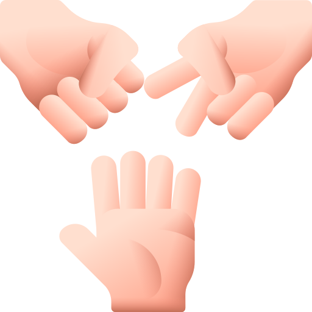

#   The Game Rock Paper Scissors 
 
Rock, Paper, or Scissors - This game has been played for ages its fantastic that we can have it digitalised. Mostly it's played with two people but with this game, it will be Player vs Computer. How it works is  Rock always beats Scissors, Scissors always beat Paper, and Paper always beat Rock. A straightforward game in which you do not need a lot of practice. With this project, I practiced Javascript including also my HTML and CSS skills. </a>

 

# Table of Content

- <a href="#demo">Demo</a>
- <a href="#ux">User Experience</a>
- <a href="#user-stories">User Stories</a>
  - <a href="#strategy">Strategy</a>
  - <a href="#scope">Scope</a>
  - <a href="#structure">Structure</a>
  - <a href="#skeleton">Skeleton</a>
  - <a href="#surface">Surface</a>
- <a href="#technologies">Technologies</a>
- <a href="#features">Features</a>
- <a href="#finalising">Finalising</a>
- <a href="#more-features">More Features</a>
- <a href="#testing">Testing</a>
  - <a href="#bugs">Bugs</a>
- <a href="#deployment">Deployment</a>
- <a href="#credits">Credits</a>
  - <a href="#acknowledgements">Acknowledgements</a>

# Demo
This game can be played in different devices.A simple page easy to manage.
It will be Player against Computer.I used "ami.responsivedesign.is" to show how the frontpage would look.

#  User Experience (UX)

Rock Paper Scissors is a game to play for fun. 
The choice is made randomly,so you win if you are only lucky.

## User stories

- Understand the purpose of this website quickly and easily.
- Easily navigate the website.
- Play a game for fun.
- Get an understanding the Rock, Paper, Scissors game.

### Strategy

The focus was on making the design a fun, user-friendly and creative site.

### Scope

For the purpose to show my knowledge in JavaScript, by creating a popular games.

### Structure

I aimed for a simple website that should contain as little clicks as possible.It have few coding compared with my first project.Adding mouse lisner to make it reponsive.

### Skeleton
The website is this designed as it it looks simple and clear.For the wireframe I used pen and paper to help me with my planning.It doesn't look like the sketch but evolved to how it looks now.

### Surface

The background color is purple and the buttons are red, green, and orchid.The purpose was to make it look fun and happy color.For the color scheme those are the colors that stand out but I have orchid for my scissor button.I used "http://colormind.io/image/" for my color palette.

## Technologies

1. HTML - To create a basic site
2. CSS - To create the pages beauty with colors and some edits on the header texts and the aligmennt of the whole page
3. JavaScript - to handle all the mechanics and make it reponsive.

## Features

ock Paper Scissors is a game with only one page divided in three sections.

* Header with the title of the game. Background color blends in well with the rest of the page. 

* Game area with a heading and three icons to choose from when playing the game. 

### Future Implementations
being able to have score history with Players names.

### Accessibility

For the accessibility this was used:
- Semantic HTML.
- Alt attributes on images
- Sufficient colour contrast.

## Testing

In contrast to the first project. I continuously tested the code along to with coding to make sure everything is ok.

Some things that come up is to add a header to each section in the html code. But I later changed the sections and just had one header added.

The CSS Validator gave me two errors. One that I had forgot to write a unit on a margin. And the second one was that I had typed "position; bottom;"
which I changed to "position; fixed;".

I also used Lighthouse in Chrome to find ways to increase the accessibility of the website. 

Links to the validation
<ul>
<li> HTML of <a href="https://validator.w3.org/nu/?doc=https%3A%2F%2Frobertahlin.github.io%2Frps-project2b%2Findex.html" target="_blank">index</a> page.</li>
<li> HTML of <a href="https://validator.w3.org/nu/?doc=https%3A%2F%2Frobertahlin.github.io%2Frps-project2b%2Fgame.html" target="_blank">game</a> page.</li>
<li> CSS of <a href="https://jigsaw.w3.org/css-validator/validator?uri=https%3A%2F%2Frobertahlin.github.io%2Frps-project2b%2Fassets%2Fcss%2Fstyle.css&profile=css3svg&usermedium=all&warning=1&vextwarning=&lang=en" target="_blank">style.css</a>.</li>
<li> To validate my JavaScript I  used <a href="https://jshint.com/" target="_blank">https://jshint.com/</a>. (Couldn't find a way to post links, directly to the JavaScript file.)</li>
</ul>

Other than the validators. I've been using the Inspect view in Google Crome using different layout for different devices and a lot with the responsive layout.
I also tested the website through my iPhone.
I've tested the website on a PC using Chrome and Edge web browsers.
Also, my mentor has tried the website. 

### Bugs? CHECK

## Frameworks, Libraries & Programs Used

- Github
- Gitpod
- Google Fonts 
- Google Dev Tools 
- Canva
- Am I Responsive? 
- Gimp
- w3 schools

## Deployment
Github Pages was used to deploy the live website. The instructions to achieve this are below:

- Log in (or sign up) to Github.
- Find the repository for this project, rock-paper-scissors.
- Click on the Settings link.
- Click on the Pages link in the left hand side navigation bar.
- In the Source section, choose main from the drop down select branch menu. Select Root from the drop down select folder menu.
- Click Save. Your live Github Pages site is now deployed at the URL shown.

## Credits
### Code Used

### Content

###  Media

  
###  Acknowledgments

 